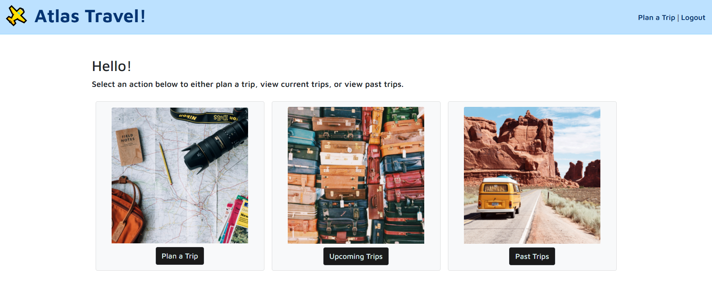

# Atlas Travel

## Description

Welcome to Atlas Travel!

Atlas Travel is a travel planner web application that helps the user document, save, and plan trips all in one place. To begin, create a username and password to log in to the application. Then, plan a trip by entering your destination, dates, and estimated budget. After saving the trip, toggle between the Upcoming Trips and Past Trips pages to keep track of your travel plans.

## Technologies Used

The following were used in the building of this webpage:

- MySQL
- Express js
- Moment js
- Sequelize
- Bootstrap
- Google Fonts API
- Unsplash API
- Heroku

## Visuals

See below the homepage for Atlas Travel:

## Links

Please find the deployed application here: https://atlas-travel.herokuapp.com/
